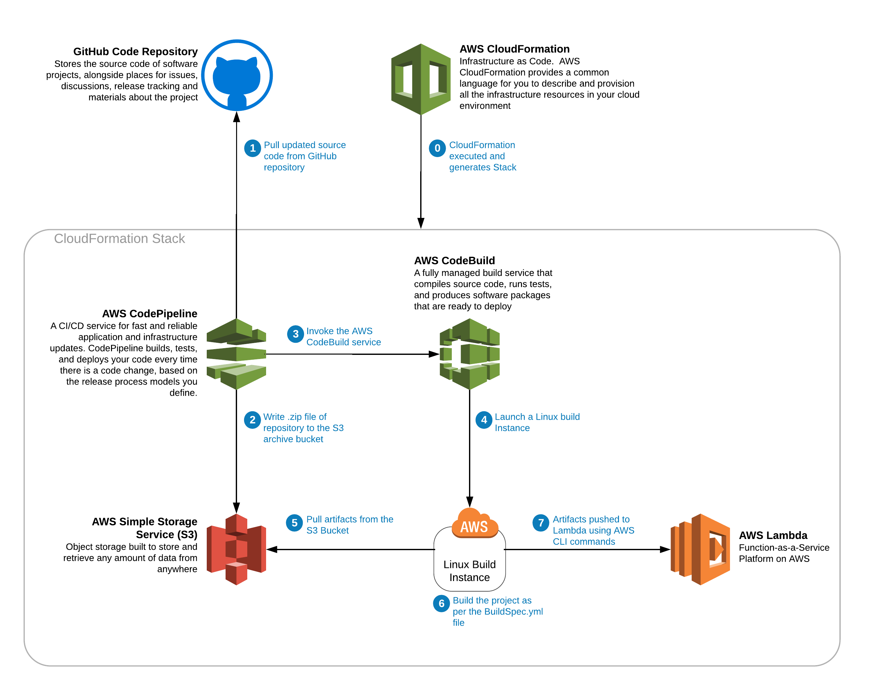

# Lambda CI/CD Pipeline for Java8 & Maven

## Overview

This repository is a simple demonstration of using a CloudFormation template to automate
the deployment of a Java8 function stored in Github from GitHub to Lambda using
AWS CodePipeline and AWS CodeBuild.  In addition to the CodeBuild and CodePipeline 
resources, the CloudFormation template will setup three roles, and S3 bucket for 
artifacts, and a Lambda function.  If the associated branch in Github has a change,
the pipeline will automatically run again and will update the Lambda function.

## Getting Started
Clicking the button below will launch a CloudFormation template.  Before you click 
this button, please make sure to open a seperate browser tab and log in to the 
AWS account and region that you would like to deploy the CloudFormation template.

Please be in US-EAST-1 region for this demonstration.

### Disclaimer
Realize that this is simply a demo.  The CloudFormation template included in this
repository would need to be customized for your application.  This repo is intended
to be a starting point for your journey through CloudFormation, Lambda, and
other AWS services.  For example, the rLambdaFunctionRole resource would need to 
be scoped for least priviledged access that is needed by your specific Lambda function.